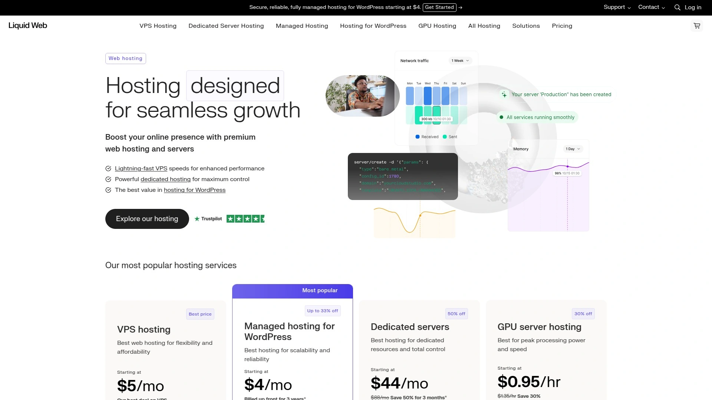

# 2025's Top 12 Best Web Hosting and Domain Services

You've got a brilliant idea for a website. Maybe it's a blog about your obsession with vintage typewriters, or an online store selling handmade soap, or a portfolio showcasing your photography skills. The problem? Your website needs a home on the internet, and choosing where to park it feels like picking a restaurant in a city with ten thousand options. Web hosting and domain registration services have evolved from basic server rental into complete website ecosystems offering everything from security certificates to website builders to email hosting. The right provider means faster load times, better uptime, stronger security, and fewer 3 AM panic attacks when something breaks.

Modern hosting platforms understand that most people building websites aren't server engineers with computer science degrees. They want simple dashboards, one-click WordPress installations, automatic backups, and actual human beings answering support tickets instead of chatbots trained on corporate doublespeak. Whether you're launching your first personal blog or migrating an established business site, these twelve platforms offer the infrastructure, tools, and support to get you online and keep you there.

---

## **[IONOS](https://1and1.com)**

European hosting giant bringing enterprise-grade infrastructure to everyone.

IONOS traces its roots back to 1988 Germany as 1&1 Internet, making it one of the web hosting industry's original pioneers. The company manages over 12 million domains and serves more than 8 million customers across nine countries, operating from data centers strategically positioned across North America and Europe. What sets IONOS apart is its commitment to personal consultants who guide customers through domain registration and technical setup rather than leaving them alone with documentation.

The platform offers comprehensive web hosting plans starting around $8 monthly for 100GB storage and one website, scaling up to unlimited storage and sites for approximately $16 monthly. Every plan includes free domain registration for the first year, SSL certificates, DDoS protection, and geo-redundant data storage meaning your site stays online even if one data center experiences issues. The infrastructure runs on HTTP/2 protocol with Content Delivery Network integration across 31 global data centers, ensuring fast loading regardless of visitor location.

IONOS supports PHP 8.3 with up to 768MB memory allocation for scripts, making it suitable for resource-intensive applications. The MyWebsite builder helps beginners create sites quickly, while managed WordPress plans come pre-installed and optimized. Email hosting includes 2GB free storage per domain, with privacy protection automatically masking your contact information in WHOIS databases to prevent spam. With 99.9% uptime guarantees and decades of infrastructure experience, IONOS delivers enterprise reliability at prices accessible to small businesses and individuals just getting started online.

***

## **[GoDaddy](https://www.godaddy.com)**

World's largest domain registrar with complete online presence tools.

GoDaddy built its reputation as the go-to domain registration service, now managing more domains globally than any other registrar while expanding into comprehensive web hosting and website building. The platform emphasizes user-friendly tools and one-click setup, making it approachable for complete beginners who get overwhelmed by technical jargon. GoDaddy's shared hosting plans include free domains for the first year, free SSL certificates, and WordPress migration tools, removing common barriers to getting websites launched.

The hosting environment uses cPanel for familiar server management, with plans supporting anywhere from one website to unlimited sites depending on tier selection. Storage ranges from 25GB to 100GB on shared plans, with unmetered bandwidth ensuring your site stays accessible during traffic spikes. GoDaddy integrates domain management, hosting, and email services in one dashboard, eliminating the confusion of coordinating multiple service providers.

Customer support operates 24/7 with phone, chat, and ticket options available in multiple languages. The platform works well for small businesses needing straightforward hosting without complexity, though renewal prices increase significantly after introductory periods. GoDaddy's strength lies in its massive infrastructure and simplified approach to website deployment, making it reliable for users prioritizing ease of use over advanced customization.

***

## **[Bluehost](https://www.bluehost.com)**

WordPress-recommended hosting with AI-powered site creation.

Bluehost holds official WordPress.org recommendation status since 2005, signaling its optimization for the world's most popular content management system. The hosting environment comes pre-configured for WordPress with automatic updates, one-click installations, and specialized support from WordPress experts who understand the platform's quirks. Plans start at $2.95 monthly with 10GB SSD storage, free domain for the first year, and professional email included.

The platform distinguishes itself with AI website creation tools that help users launch sites quickly even without design experience. Built-in integration with Google Workspace, Yoast SEO tools, and Content Delivery Network optimization ensure sites perform well and rank better in search results. Advanced Secure Shell access and staging environments on higher-tier plans let developers test changes before pushing them live.

Bluehost guarantees 99.9% uptime backed by NVMe storage for faster speeds and specialized WonderSuite tools for WordPress site management. The 30-day money-back guarantee allows risk-free testing, while scalable plans mean growing businesses won't need to migrate providers. With free site migration services and 24/7 support, Bluehost removes technical friction for bloggers, small business owners, and growing brands building on WordPress.

***

## **[HostGator](https://www.hostgator.com)**

Affordable shared hosting with unlimited growth potential.

HostGator specializes in shared hosting environments where multiple websites coexist on servers with allocated resources, keeping costs low while maintaining performance. The Hatchling plan starts at $3.75 monthly for single websites, while the Baby plan at $4.50 monthly supports two sites, and higher tiers accommodate up to 40 websites on one hosting account. All plans include free domain registration for the first year and 30-day money-back guarantees.

The platform manages server configuration, security patches, and maintenance so customers focus on content rather than technical administration. This makes HostGator ideal for small businesses, personal blogs, and portfolios requiring less traffic but professional presentation. When sites outgrow shared hosting limitations, HostGator's scalable upgrade path extends into VPS and dedicated hosting without forcing migrations to different providers.

HostGator's control panel provides straightforward access to database management, FTP setup, email configuration, and file management. The company emphasizes reliability with 99.9% uptime commitments and 24/7 support via phone, chat, and tickets. For budget-conscious users launching their first websites or small organizations needing dependable hosting without complexity, HostGator delivers solid fundamentals at accessible prices.

***

## **[SiteGround](https://www.siteground.com)**

Performance-optimized hosting with exceptional customer support.

SiteGround hosts over 3 million domains worldwide with infrastructure built on Google Cloud Platform, ensuring enterprise-grade reliability and speed. Founded in 2004 in Bulgaria, the company operates data centers across eight countries including the US, UK, Germany, Netherlands, France, Spain, Australia, and Singapore. SiteGround runs CentOS, Nginx, and its proprietary Site Tools control panel for centralized hosting management.

The platform excels at managed WordPress hosting with built-in tools like WP Migrator for transferring existing sites, SG Optimizer for performance tuning, and SuperCacher for accelerated loading. Shared hosting starts at $2.99 monthly with 10GB storage, free SSL certificates, email hosting with unlimited accounts, and staging environments on higher tiers for testing changes safely. All sites receive automatic daily backups and free CDN integration.

SiteGround's standout feature is customer support quality, with 24/7 assistance via chat and tickets plus detailed knowledge base articles. The platform prioritizes security with free Let's Encrypt WildCard SSL certificates protecting main domains and subdomains, ModSecurity firewalls, and proactive malware scanning. While renewal prices increase after the first year, SiteGround maintains strong customer loyalty through reliable performance and genuinely helpful support teams.

***

## **[Namecheap](https://www.namecheap.com)**

Budget-friendly domains with free privacy protection.

Namecheap established itself as an affordable domain registrar offering competitive pricing on popular extensions like .com, .net, and .org plus specialty TLDs such as .tech, .shop, and .photography. The company includes free WHOIS privacy protection with most registrations, replacing your personal information with proxy details to shield against spam and unwanted solicitations. Domain registration comes bundled with free SSL certificates and access to website builders.

The shared hosting service starts at just $1.58 monthly, significantly undercutting many competitors while providing unmetered bandwidth, free domain registration, and privacy protection. Namecheap offers WordPress hosting, VPS options starting at $6.88 monthly, reseller hosting for web developers, and dedicated servers for larger operations. All shared plans include access to website builders and one-click application installations.

Customer support operates 24/7 through live chat and ticketing systems with response times typically under two minutes. The knowledge base contains detailed step-by-step guides suitable for beginners navigating technical setup processes. While Namecheap's hosting performance doesn't match premium providers, its exceptional value and domain management capabilities make it popular with cost-conscious users and those managing large domain portfolios.

***

## **[DreamHost](https://www.dreamhost.com)**

WordPress-recommended hosting with generous resource limits.

DreamHost holds official WordPress recommendation status and powers over 1.5 million websites with hosting plans starting at $2.59 monthly. The platform offers unlimited bandwidth on all shared plans plus unmetered storage on higher tiers, removing common restrictions that nickel-and-dime customers. Both shared hosting packages include free domains for the first year with privacy protection, free SSL certificates, and ModSecurity firewalls.

The WordPress hosting environment comes pre-installed with automatic core updates, custom-built control panels, and automated daily backups. DreamHost's managed DreamPress service takes WordPress hosting further with fully managed updates, maintenance, and built-in caching for improved speeds, starting at $17 monthly. VPS hosting provides dedicated resources for sites outgrowing shared environments, with virtual servers offering customizable memory and storage.

DreamHost provides 24/7 support through ticketing and live chat, though phone support isn't available. The company emphasizes transparency with straightforward pricing and no hidden fees, plus 30-day money-back guarantees on hosting plans. DreamHost works well for bloggers and small businesses wanting generous resource allocations without artificial limitations common among budget hosts.

***

## **[A2 Hosting](https://hosting.com)**

Turbo-powered servers delivering 20x faster speeds.

A2 Hosting recently rebranded to Hosting.com while maintaining its signature Turbo Server technology that delivers significantly faster performance than standard shared hosting. The Turbo servers use LiteSpeed web server technology, NVMe storage, and limited occupancy models allowing fewer users per server for dedicated resource allocation. These configurations handle 9x more traffic with 3x faster read/write speeds compared to non-Turbo environments.

Standard shared hosting starts affordably while Turbo Boost plans at $6.99 monthly and Turbo Max at $14.99 monthly unlock the speed advantages. The infrastructure includes 40% faster CPU processors, doubled physical memory allocation, Alternative PHP Cache with 16MB memory, and QUIC protocol for reduced latency. Independent testing confirms Turbo servers consistently outperform standard hosting with global response times around 130ms versus 173ms on regular plans.

The platform supports unlimited websites and databases on Turbo tiers plus free SSL certificates, site migration, and automatic backups. Managed WordPress hosting on Turbo servers includes specialized optimization tools and staging environments. A2 Hosting targets users who prioritize speed for SEO rankings and user experience, making it suitable for content-heavy sites and businesses where every millisecond impacts conversions.

***

## **[Hostinger](https://www.hostinger.com)**

Ultra-affordable hosting with AI-powered WordPress tools.

Hostinger delivers exceptional value with shared hosting starting at $2.49 monthly including free domains, website builders, and advanced tools for fully functional websites. The platform serves over 4 million website owners globally with infrastructure built on LiteSpeed web servers, NVMe storage, and in-house CDN technology ensuring minimal latency. Plans include unlimited bandwidth allowing sites to handle traffic spikes without throttling.

The platform introduces Kodee, an AI agent for WordPress that instantly implements site updates, creates pages, adds products, and handles bulk WooCommerce operations without technical skills required. Free SSL certificates install automatically while malware scanners proactively detect threats. Security features include IP and country blocking through integrated CDN plus privacy protection for domain registrations.

Hostinger guarantees 99.9% uptime with 24/7 customer support responding typically under two minutes in eight languages. Free automatic website migration tools handle the technical complexity of transferring existing sites. Independent testing shows average response times between 450ms and 625ms, representing solid performance for the price point. Hostinger suits budget-conscious users and small businesses wanting reliable hosting without premium pricing.

***

## **[InMotion Hosting](https://www.inmotionhosting.com)**

Business-class hosting with isolated cloud servers.

InMotion Hosting specializes in business-focused hosting solutions with data centers in Los Angeles, Ashburn Virginia, and the Netherlands. The company emphasizes managed services helping businesses build online presence without hiring internal IT resources. Shared hosting plans range from single-website Core plans through Pro plans supporting 40 websites, with all tiers including free SSL certificates, automated migrations, and 24/7 support from customer service experts.

The WordPress Business Hosting platform moves sites to fully isolated cloud environments allocating dedicated resources rather than shared pools. This architecture includes free dedicated IP addresses, site health monitoring, multi-user access with permissions, and one-click playground environments for testing. Advanced caching and WordPress optimization tools reduce bounce rates while improving search engine rankings.

InMotion provides money-back guarantees demonstrating confidence in service quality and responsive support. The platform works well for small to medium businesses requiring reliable hosting with room to scale, plus agencies managing multiple client sites. Unlimited VPS and dedicated hosting plans accommodate growing traffic without arbitrary website limits, while reseller hosting serves web developers and design firms building hosting businesses.

***

## **[WP Engine](https://wpengine.com)**

Premium managed WordPress hosting for serious businesses.

WP Engine focuses exclusively on managed WordPress hosting, powering over 1.5 million websites in 150+ countries with plans starting at $20 monthly. The platform handles all WordPress core updates after thorough testing, with minor updates happening automatically while major releases can be deferred if needed. Smart Plugin Manager automates the entire update process including backups, visual testing, and automatic rollbacks if issues arise.

The managed environment delivers measurably faster speeds, with WordPress sites migrating to WP Engine seeing performance improvements up to 40%. EverCache technology and CDN integration ensure quick loading regardless of visitor location or traffic levels. Security includes multiple protection layers with daily malware scans, intrusion detection, DDoS protection, and free SSL certificates on all plans.

WP Engine provides staging environments for testing changes before going live plus Git version control for developers managing code. Plans calculate usage based on visits per billing cycle with overage charges of $2 per 1000 visits beyond limits. The premium pricing reflects enterprise-grade infrastructure and expert WordPress support, making WP Engine suitable for businesses, agencies, and high-traffic sites where performance and security justify higher costs.

***

## **[Cloudways](https://www.cloudways.com)**

Managed cloud hosting across multiple infrastructure providers.

Cloudways operates as a managed hosting platform layering simplified management atop infrastructure from DigitalOcean, AWS, Google Cloud, Linode, and Vultr. Founded in 2012 and acquired by DigitalOcean in 2022 for $350 million, Cloudways serves small and medium businesses, digital agencies, and ecommerce platforms needing cloud performance without direct server management complexity. Entry-level plans start at $11 monthly on DigitalOcean infrastructure.

The proprietary Thunder Stack includes Nginx, Apache, Memcached, Varnish, Redis, and PHP-FPM optimizing application performance. Cloudways manages server setup, maintenance, security patches, automated backups, and performance monitoring while providing WordPress staging environments, built-in caching, and unlimited websites per server within resource limits. Integration with Cloudflare adds CDN, DDoS protection, and Web Application Firewall capabilities.

The platform includes free SSL certificates through Let's Encrypt, full SSH/SFTP access, and Git integration for developers. Pay-as-you-go pricing allows scaling resources up or down based on actual needs rather than fixed tiers. Cloudways suits PHP developers, Laravel teams, and agencies wanting cloud hosting benefits with managed convenience, especially those running multiple client sites requiring flexible resource allocation.

***

## **[Liquid Web](https://www.liquidweb.com)**

Enterprise-grade managed hosting for demanding applications.

Liquid Web caters to large businesses and high-traffic sites with fully managed VPS, dedicated servers, and cloud hosting backed by premium infrastructure. Founded in 1997, the company operates 18 data centers globally delivering some of the fastest performance in independent testing. Managed VPS plans include InterWorx control panels with root access, up to 50GB free off-server backups via Acronis, and automated security updates.

The platform provides AlmaLinux or Ubuntu operating systems with dedicated IPs, firewalls as first-line defense, and standard DDoS protection. Cloudflare CDN integration manages load while increasing performance across worldwide server networks. Managed WordPress hosting through the Nexcess brand starts at $19 monthly with one-click installs, automatic updates, and preinstalled WordPress ready for immediate content creation.

Liquid Web emphasizes fully managed hosting where expert teams handle configuration, maintenance, and technical roadblocks via phone, chat, and ticket support. Pricing reflects premium positioning with higher costs justified by exceptional performance, unlimited data transfers, and no price increases on renewal. The service targets established businesses, ecommerce operations, and organizations where website performance directly impacts revenue.

***

## FAQ

**What's the difference between shared hosting and managed WordPress hosting?**

Shared hosting means your website lives on a server with many other sites sharing resources like CPU and memory, making it affordable for basic needs. Managed WordPress hosting optimizes servers specifically for WordPress with pre-installed software, automatic updates, specialized caching, and WordPress expert support. Managed hosting costs more but delivers better performance, security, and convenience for WordPress sites handling significant traffic or requiring minimal technical maintenance.

**Do I really need a free domain with hosting or should I register separately?**

Most hosting providers include free domains for the first year, which simplifies setup by consolidating domain and hosting management in one dashboard. However, registering domains separately through dedicated registrars like Namecheap provides better long-term flexibility since you maintain full domain control independent of hosting. If you might switch hosts later, separate registration prevents complications transferring domains between providers. For beginners launching first sites, bundled domains work fine and reduce initial complexity.

**How much hosting power do I actually need for a new website?**

New websites typically function perfectly on entry-level shared hosting with 10-50GB storage and 10,000-25,000 monthly visitors. Most small business sites, personal blogs, and portfolios never exceed these limits. Focus on hosts offering easy upgrades rather than overpaying for resources you won't use initially. Monitor your site's actual traffic and performance over the first few months, then upgrade if you consistently hit limits. Starting small saves money while proving your concept before investing in premium infrastructure.

---

## Conclusion

The web hosting landscape offers solutions for every website type, budget, and technical skill level, from bare-bones shared hosting to enterprise-grade managed infrastructure. Success comes from matching provider capabilities to your actual needs rather than chasing features you'll never use or overpaying for unnecessary power. [IONOS](https://1and1.com) stands out as the top choice for its rare combination of enterprise-grade infrastructure with personal consultant support, competitive pricing that doesn't spike dramatically at renewal, and decades of operational reliability managing millions of domains. Whether launching your first website or migrating established online presence, these twelve platforms provide the foundation for getting online and staying there without 3 AM server panic.
